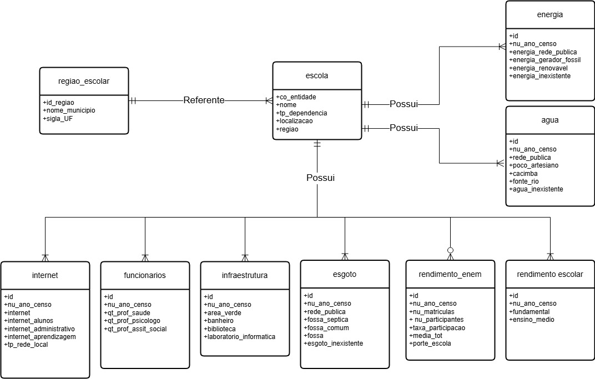

# Projeto MC536
> Projeto 1 da disciplina de Banco de Dados MC536 da Unicamp

## 🌎 Objetivo de Desenvolvimento Sustentável
Este projeto se relaciona com a ODS 4 – Educação de qualidade, especialmente com as metas 4.4 e 4.c. Ao cruzar dados sobre a infraestrutura das escolas com o desempenho dos alunos no ENEM, buscamos entender como fatores como acesso à internet, biblioteca, saneamento e laboratórios impactam a formação de habilidades importantes para o mercado de trabalho. Isso contribui para pensar políticas que melhorem o ambiente escolar e ajudem no desenvolvimento de competências técnicas e profissionais (meta 4.4), além de apoiar decisões sobre a formação e distribuição de professores qualificados (meta 4.c).

## 📕 Modelo Conceitual



## 💻 Tutorial para uso 

1. Crie uma pasta vazia no diretório /tmp chamada data/;
2. É nessa pasta que os arquivos derivados do tratamento de dados vão parar;
3. O arquivo `implementacao.py` mexe num banco de dados chamado implementacao_python, recomendo criar mas pode colocar em qualquer um, é so mudar o nome do banco de dados no arquivo `implementacao.py` e sua senha;
4. Na linha 7 do código de `implementacao.py` é necessário ajustar o caminho para o arquivo `import.sql`, que está na pasta `code` deste trabalho, para o caminho até essa pasta em seu computador. Não esqueça de salvar o arquivo após as alterações;
``` python
conn = psycopg2.connect(
dbname="nome",
user="postgres",
password="********",
host="localhost",
port="5432")
```
5. O arquivo vai então importar, descartar e recriar todas as tabelas do banco de dados e depois vai partir para a população de dados;
6. Tenha certeza de que todos os arquivos de `data.zip` do tipo **parsed.csv**  estão em /tmp;
7. O código vai fazer cada importação separadamente;
8. Depois ele realiza as consultas.

> Obs.: na tabela regiao_escolar o id é id_regiao, nas demais tabelas essa key é referenciada como regiao_id, cuidado para não confundir.

## 🤝 Grupo
- Pedro Henrique dos Reis Arcoverde `RA: 254719`
- Leonardo da Silva Giovanelli de Santana `RA: 256472`
- Antonio Carlos Carvalho Macedo `RA: 199152`
